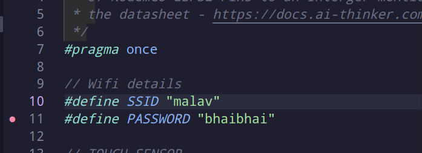

# GARAGE DOOR ESP32

# User Manual

## Pre-Requisties
- Computer / Laptop
- ESP32
- Rotary Encoder Module
- Capacitive Touch Sensor Module
- 9G servo motor Module
- 8x2 LCS Display Module
- Micro USB data transfer cable
- ESP32 connected with the below given PINs connected to the Modules [Look here for Datasheet](https://docs.ai-thinker.com/_media/esp32/docs/nodemcu-32s_product_specification.pdf) and connect the modules with ESP32
    - Capacitive Touch Sensor
        - TOUCH_SENSOR 15
    - LCD
        - RS 4
        - RW 0
        - ENABLE 16
        - D4 17
        - D5 5
        - D6 18
        - D7 19
    - Rotary Encoder
        - RE_BUTTON 21
        - RE_CLK 22
        - RE_DAT 23
    - Servo
        - SERVO 13
- git (version control system) installed
- g++ version 12.2 installed
- 2 AtSign created and activated at [AtSign](https://my.atsign.go) (follow instruction on the activation)
- 2 AtSign private and public encryption keys downloaded
- VS-code installed on the system
- VS-code extenstion for [PlatformIO](https://marketplace.visualstudio.com/items?itemName=platformio.platformio-ide) is installed
- Java 8 jdk installed on the system
- apache maven installed

## Setup

Once the ESP32 is wired up with all the modules mention in pre-requisite, you need to
download the source code for the EPS32 that needs to be uploaded to ESP32.

### Step - 1 
Clone the following repository with

```sh
git clone https://github.com/UMB-CS-410-TEAM-03/ESP32
```

CLone the following App repository

```sh
git clone https://github.com/UMB-CS-410-TEAM-03/UIjava
```

### Step - 2
Now open the ESP32 repository in VS-code and wait for the PlatformIO to complete downloading the libraries that are used in ESP32.

### Step - 3
Connect the MicroUSB cable with the computer / laptop and the MicroUSB port on the ESP32

### Step - 4
Now place the private encryption keys downloaded for your AtSign in the data directory.

Update the name of the AtSign you are using for the ESP32 (in src/main.cpp line 355)

Update the name of the AtSign you are using for the UI application to one you have gotten. (in src/main.cpp line 356)

### Step - 5

Change the SSID and PASSWORD of your home WIFI in include/constants.h


### Step - 6

Now we will upload the private keys to ESP32.

Press and hold the BOOT button and press the RESET button on the ESP32 when connected to the computer / laptop to put the ESP32 in download mode.

Then from the computer in VS-code on side bar click on the PlatformIO extension (Alien face Icon) click on Build Filesystem Image.

and Once completed Upload Filesystem Image.

### Step - 7

Now Press and hold the BOOT button and Press the RESET button again to put in to download mode.

Click on the Upload and Monitor in the Sidebar.

It will take a bit to compile the source code and upload it to ESP32 when you see uploading percentage in the terminal close stop holding on to the BOOT button on ESP32.

### Step - 8

Open the UIjava repository in other VS-code window.

Place the private AtSign encryption keys you are using for UI application in keys directory in the UIjava repository.

Rename the AtSign's you are using for your ESP32 and UI application in src/main/java/app/opensesame/App.java line 21 and line 22.

### Step - 9 

Build the java app from either the CLI 

```sh
mvn test
```

and run with

```sh
cd target/classes
java app.opensesame.App
```

or If you have the Java Extension Installed in VS-code you can press the run button.

## Running / Using the app and device

On the ESP32 connected module once the LCD shows the Door Closed message you can touch the Capactive Touch Sensor to open / close the door.

When you want to open the door manually for certain amount, you can press the Rotary Encoder to change the mode for Set -> Change and Rotate the Rotary Encoder Clockwise to open the door and Anti-Clockwise to close the door.

As you perform the action you can see the UI reflecting those changes to actions you performed on the hardware side.

Now on you UI application you can click on the button that is below the Image of the door to perform the action for **Open / Close or Halt**.

# Code Manual

```cpp
/**
 * An Enum mapping the events that can occur or are generated to
 * handle the input and output from various pin on EPS32 or from
 * reading the at_sign secondary server.
 */
/// Event is documented
enum Event {
    // Sync the status of Door with at_sign secondary server
    SYNC_DOOR,
    // Sync the RE_VALUE with at_sign secondary server
    SYNC_RE,
    // Occurs when we are required to open the door
    DOOR_OPEN,
    // Occurs when the door has been opened
    DOOR_OPENED,
    // Occurs when the door is required to be closed
    DOOR_CLOSE,
    // Occurs when the door has been closed
    DOOR_CLOSED,
    // Occurs when we are required to stop the door opening or closing
    DOOR_HALT,
    // Open 20% of the door
    DOOR_OPEN_BY_20,
    // Close 20% of the door
    DOOR_CLOSE_BY_20,
    // On LCD module show the Door Status
    LCD_SHOW_DOOR_STAT,
    // On LCD module show the RE_VALUE as percentage
    LCD_SHOW_RE_STAT,
    // Occurs when Rotary Encoder Module button is pressed to change the value
    RE_CHANGE,
    // Occurs when Rotary Encoder Module button is pressed to set the value
    RE_SET,
    // Occurs when Rotary Encoder Module is moved in positve side.
    RE_INC,
    // Occurs when Rotary Encoder Module is moved in negative side.
    RE_DEC,
};
```

```cpp
/**
 * Description: TouchInterruptHandler() will be used as callback for
 * arduino attachInterruptHandler method, with RISING mode to handle
 * the touch event from Capacitve Touch Sensor Module more efficeintly.
 * The function will be adding the events to event bus based on the state
 * of constant DOOR_STATUS.
 * Pre: A static EventBus events and DoorStatus DOOR_STATUS should have been
 * declared and present in GLOBAL.
 * Post:
 * If door is open then event to close the door will be added.
 * If door is closed then event to open the door will be added.
 * If door is opening or closing then event to halt the door will be added.
 */

void TouchInterruptHandler();

/**
 * Description: REButtonHandler() will be used as callback for
 * arduino attachInterruptHandler method, with RISING mode to handle
 * the button press from Rotary Encoder Module more efficeintly.
 * The function will add events to event bus based on the state of
 * constant RE_STATUS.
 * Pre: A static EventBus events and RE_STATUS should have been declared
 * and present in GLOBAL.
 * Post:
 * On Press of the button
 * If RE is in CHANGE mode then RE_STAUS is set to RE_SET.
 * If RE is in SET mode then RE_STATUS is set to RE_CHANGE.
 */
void REButtonHandler();

/**
 * Description: RERotateHandler() will be used as callback for
 * arduino attachInterruptHandler method, with Falling mode to handle
 * the Output from CLK Pin of Rotary Encoder Module more efficeintly.
 * The function will add events to event bus if the Rotary Encoder dial
 * was moved in positive side or negative side.
 * Pre: A static EventBus events, RE_VALUE and RE_STATUS should have been
 * declared and present in GLOBAL.
 * Post:
 * If the Dial on Rotary Encoder was rotated in positive side
 * then RE_INC event will be added in EventBus else RE_DEC event will be
 * added on the event bus.
 */
void RERotateHandler();

//-------------- Event Handlers ------------------------------------------//

/**
 * Description: This function will add all the events in the event bus
 * that needs to performed for the action of door opening.
 * Pre: None
 * Post: Events are added to EventBus
 */
void door_will_open();
/**
 * Description: This function will add all the event in the event bus
 * that will needs to be performed when door is opened and will update
 * the RE_VALUE to RE_MIN to indicate the door has been opened.
 * Pre: None
 * Post: Events are added to EventBus
 */
void door_has_opened();
/**
 * Description: This function will add all the events in th event bus
 * that needs to be performed for the action of for door closing.
 * Pre: None
 * Post: Events are added to EventBus
 */
void door_will_close();
/**
 * Description: This function will add all the events in the event bus
 * that will needs to be performed when door is closed and will update
 * the RE_VALUE to RE_MAX to indicate the door has been closed.
 * Pre: None
 * Post: Events are added to EventBus
 */
void door_has_closed();
/**
 * Description: This function will remove all the events in event bus
 * that are responisble for the movement of door i.e. DOOR_OPEN_BY_20 and
 * DOOR_CLOSE_BY_20 and will add all the event in th event bus
 * that needs to be performed for the action of for door halting.
 * Pre: None
 * Post: Events are added and removed from EventBus
 */
void door_is_halted();

/**
 * Description: This function is responisble for the calling the procedures
 * that will change the servo motor module's angle so the door is opened by 20%.
 * Pre:
 * Post: Servo angle is update to accommodate the door opening byy 20%
 */
void door_open_by_20();
/**
 * Description: This function is responisble for the calling the procedures
 * that will change the servo motor module's angle so the door is closed by 20%.
 * Pre: None
 * Post: Servo angle is update to accommodate the door closing by 20%
 */
void door_close_by_20();

/**
 * Description: This function is responsible to show the message on LCD that
 * displays the current state of the door.
 * Pre:
 * Post: The LCD module will have the DOOR_STATUS displayed in a Formatted message.
 */
void lcd_show_door_stat();
/**
 * Description: This function is responsible to show the message on LCD that
 * displays the current percentage the door is Open when RE_STATUS is set to
 * REStatus:change
 * Pre:
 * Post:
 */
void lcd_show_re_stat();

/**
 * Description: This function is responisble to calling the proceduers that
 * will update the AtSign secondary server with the current status of the Door.
 * Pre:
 * Post: The remote AtSign secondart server is updated with the current status of
 * the door.
 */
void door_sync_status();
/**
 * Description: This function is responisble to calling the proceduers that
 * will update the AtSign secondary server with the current value of the Rotary Encoder.
 * Pre:
 * Post: The remote AtSign secondart server is updated with the current value of RE.
 */
void re_sync_status();

/**
 * Description: This function is responisble to update the GLOBAL variable RE_STATUS to
 * RE_CHANGE and will add event to display the RE_VALUE on LCD.
 * Pre: None
 * Post: The GLOBAL variable is updated, Event is added in EventBus
 */
void re_will_change();
/**
 * Description: This function is responisble to update the GLOBAL variable RE_STATUS to
 * RE_SET and will add event to display the RE_VALUE on LCD.
 * Pre: None
 * Post: The GLOBAL variable is updated, Event is added in EventBus
 */
void re_was_set();
/**
 * Description: This function is responisble to add events that will close the door by 20%
 * and sync the information with AtSign secondary server.
 * Pre: None
 * Post: Will add the events in EventBus neccsary to perform manual closing of door by 20%
 */
void re_value_increased();
/**
 * Description: This function is responisble to add events that will open the door by 20%
 * and sync the information with AtSign secondary server.
 * Pre: None
 * Post: Will add the events in EventBus neccsary to perform manual opening of door by 20%
 */
void re_value_decreased();
```

```cpp
/**
 * A helper class EventBus uses a deque underneath
 * to create an EventBus that manages to events that have occured or need to be
 * handled by the code when the main loop is busy performing action.
 */
template <typename T>
class EventBus {
    deque<T> events;

public:
    /**
     * Description: Checks if EventBus is empty.
     * Pre: None
     * Post: Returns true if EventBus is empty.
     */
    boolean empty();

    /**
     * Description: Return the current event that needs to be handled.
     * Pre: None
     * Post: Return Event that is first in EventBus.
     */
    Event current();

    /**
     * Description: Add an event that needs to be handled to EventBus.
     * Pre: None
     * Post: An event that needs to be processed will be added to EventBus.
     */
    void add(T e);

    /**
     * Description: Add an event that needs to be handled on first priority to EventBus.
     * Pre: None
     * Post: An event that needs to be processed immediatly will be added to EventBus in the front.
     */
    void sos(T e);

    /**
     * Description: Mark the current event as completed and remove from the event bus.
     * Pre: None
     * Post: The first event from the event bus will be removed.
     */
    void current_completed();
};
```